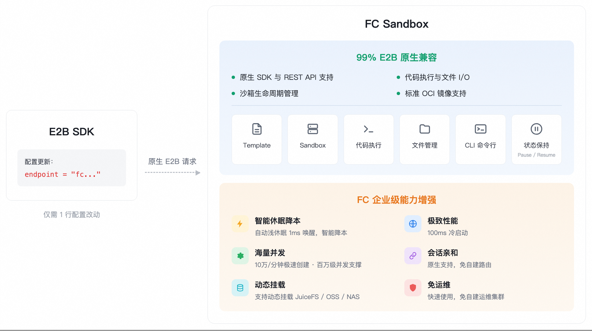

# E2B 兼容概述

## 功能简介

云沙箱原生兼容 E2B，仅需修改一行 Endpoint 即可开箱即用。它可以为 AI Agent、代码解释器、自动化任务和数据处理流程按需创建隔离的运行环境，让应用通过 SDK（Python / TypeScript）或 CLI 在远端沙箱里执行命令、运行代码、读写文件，并在任务结束后销毁资源。

云沙箱当前仅支持**华北2（北京）**地域。

## 适用场景

1. **有状态 Agent 长时交互**
  面向 AI Agent、OpenClaw、RL 仿真等有状态长交互场景，基于会话亲和性保持内存与文件上下文，消除频繁重启导致的状态丢失与延迟。
2. **安全代码执行与数据处理**
  在 MicroVM 隔离环境中远程执行 Python、Shell 等任意命令；内置 code-interpreter 模板，无缝对接 OSS、NAS 、PolarLakebase等企业主流存储，无需数据搬迁即可快速完成数据分析、文件处理及脚本执行，实现数据安全与开发效率的双重保障。
3. **浏览器自动化与复杂网页交互**
  CDP 协议连接远端 Chrome，精准操控动态渲染页面（SPA），稳定维持登录态与 Session，适配 RPA 流程自动化、前端 UI 测试及深度信息提取。
4. **海量仿真与大规模并行评估**
  面向 RL 任务及 Agent 能力评测，提供百万级并发支撑；凭借秒级启动 5000+ 异构 3GB 镜像实例的极致冷启效率，实现 5000 并发/秒的高吞吐创建，显著缩短大规模并行评估周期，极致优化算力成本。
5. **企业级开发运维一体化**
  基于自定义镜像预装依赖、工具及证书，构建标准化业务模板以确保环境一致性；利用 JuiceFS 企业版的跨云同步能力持久化代码与配置，实现开发状态的全球一致性与无缝保留，支持分布式团队高效协作；提供 CLI 工具链统一管理生命周期、日志及监控，实现研发运维高效闭环。

## 产品优势

- **零代码无缝迁移：**原生 E2B SDK 直连，99% 功能兼容，仅需修改 1 行 Endpoint 配置就能无缝迁移，开箱即用。
- **企业级能力增强：**自动浅休眠（1ms 唤醒）智能降本，100ms 冷启动，百万并发弹性能力，原生支持会话亲和零运维。

## 后续步骤

- [通过 SDK 创建第一个云沙箱](https://help.aliyun.com/zh/functioncompute/fc/create-your-first-cloud-sandbox-via-the-sdk)
